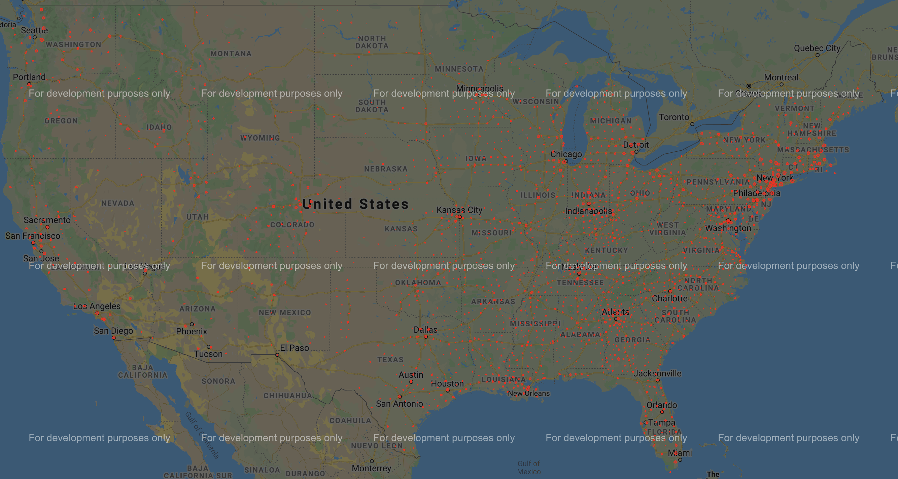

# Coronavirus-Cases-Heat-Map
This program takes daily updated coronavirus case data in the US by county from the New York Times and graphs the spread and growth on a google map. 

Packages needed = [1:geopy, 2:datetime, 3:pandas, 4:numpy, 5:gmplot]
1. geopy: retrieves latitude and longitude data to apply to custom csv file.
2. datetime: (comes pre-installed with python) to check that the data is the most updated data. "MostRecentDay.txt" stores the            most recently updated date. 
3. pandas: All of the data is manipulated and stored in pandas dataframes.
4. numpy: addiitonal mathmatical operations.
5. gmplot: applies python data to a google map saved in an html file. 
 
**"Counties_backup.csv" stores a list of all the counties by name and their latitude and longitudes in case the data from "counties.csv" gets deleted, corrupted, or ruined. Calling the initializeCountiesFile() function will fix the data in "counties.csv", but the function takes several hours to run due to limit of latitude and longitudes that can be requested a minute. The "Counties_backup.csv" serves as a backup. 

**To use the program a google map api key is needed. As shown below the graph will display "for development purposes only" unless you pay for the google cloud service. 

**As long as the "Counties.csv" file remains intact and the latitude and longitude data is preserved, the initializeCountiesFile() function never needs to be run. 

RUNNING PROGRAM: 

1: Retrieve a google map api key from https://developers.google.com/maps/documentation/javascript/get-api-key. Enter in the key here: gmap.apikey =  "API_KEY_HERE". This is within the createMap() function.
2: Run program and wait for the html file containing the google map to save.
3: Open the html file in a browser 

https://github.com/nytimes/covid-19-data -> Data used from NYT 

